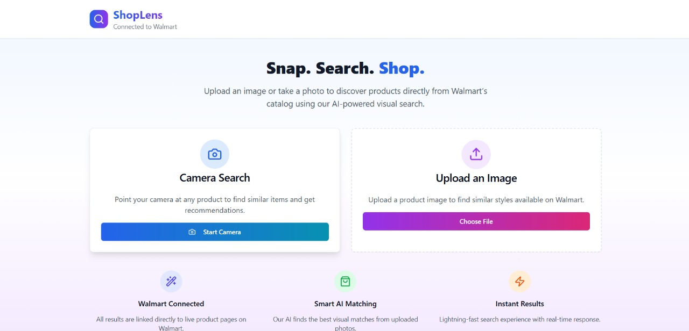
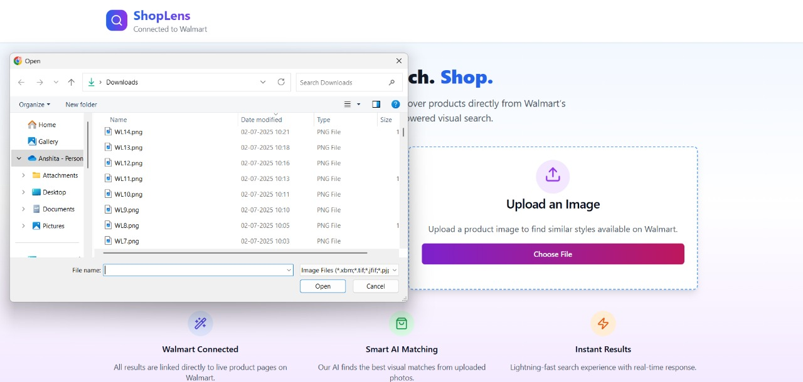
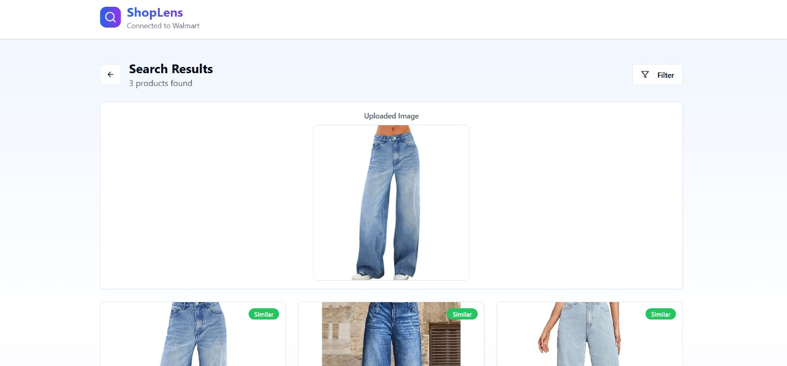
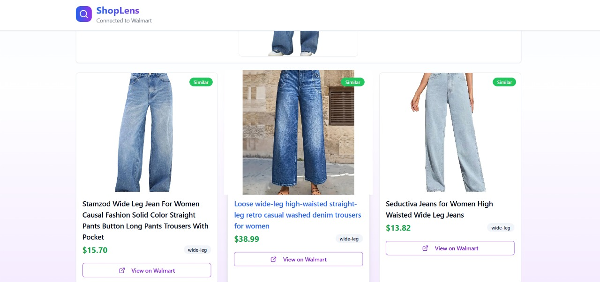
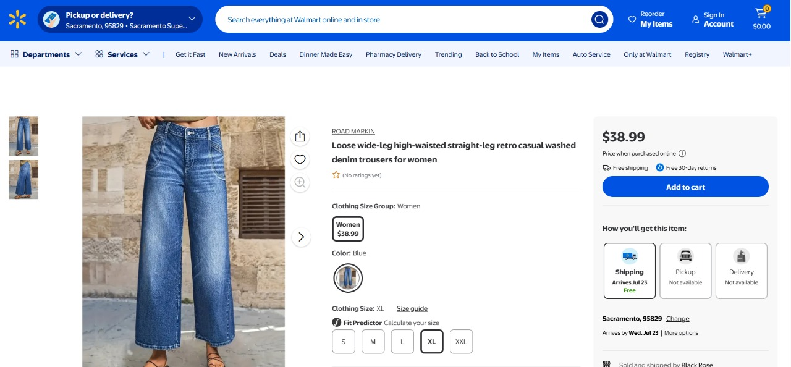

# 🛍️ ShopLens – Your Visual AI Shopping Assistant :) 

**ShopLens** helps users find visually similar products on **Walmart** by simply uploading or clicking a picture of an item they don’t know the name of or want to shop an exactly similar item. Whether it’s a piece of furniture, an electronic gadget, a kitchen tool, or a fashion item — ShopLens uses image-based search powered by machine learning to connect users with lookalike products directly from Walmart.

---

## ⚙️ Features

- 🧠 AI/ML powered product similarity detection
- 🔍 Visual search for any item — not just fashion
- 🔗 Live redirection to Walmart product links
- 🌐 Built with modern web tools (Vite + React + Tailwind)
- 💡 Scalable, modular project structure
- 🎯 Ideal for visually-driven shopping experiences

---
### Step 1: Upload or Click a Picture  
> *"I found this cool product and want to buy similar items !"*  
📷 Upload or click a picture of any unknown item directly in the app.

---

### Step 2: Image Feature Extraction  
🔬 Our ML pipeline processes the image and extracts its visual features using pretrained models like ResNet or CNN variants. These features are then converted into vectors.

---

### Step 3: Find Similar Products  
🧠 Using cosine similarity, we match the vector against a dataset of Walmart products and retrieve the most visually similar items.

 

---

### Step 4: Visit Product Page  
🔗 Want to buy it? Click the result and get redirected to the official Walmart product page.

---

### 🛒 Enjoi Shopping!  

---

## 💡 Why These Tech Stacks? – Q&A Format

**Q: Why React + Vite in frontend?**  
🟢 Vite offers blazing-fast HMR and React helps build modular UIs.

**Q: Why Tailwind CSS?**  
🟢 We needed utility-first, responsive design without writing custom CSS.

**Q: Why Node.js and Express for backend?**  
🟢 Lightweight and perfect for serving APIs and handling image-to-ML script routing.

**Q: Why Python for ML?**  
🟢 Python provides a rich ecosystem (NumPy, sklearn, OpenCV) for image feature processing and similarity search.

**Q: Why Walmart?**  
🟢 Easy access to product data, wide category range, and real-world impact with link-based redirection.

---

